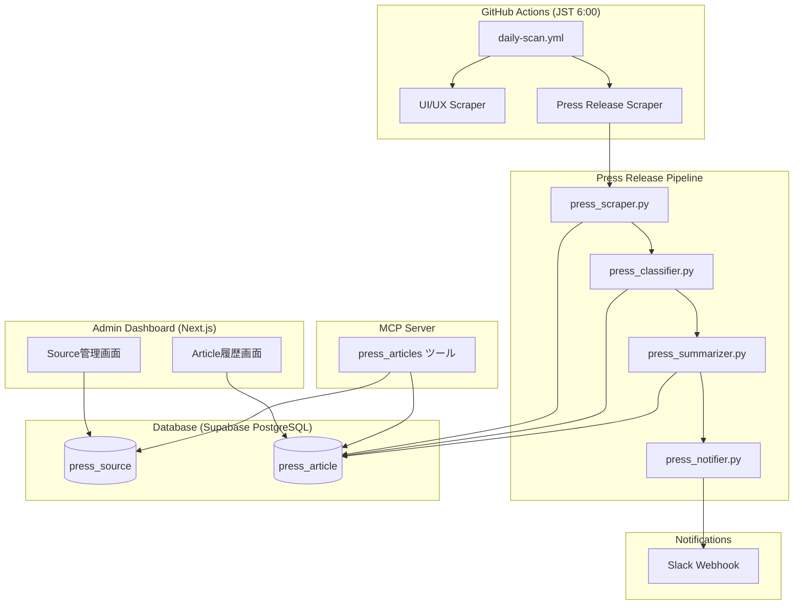
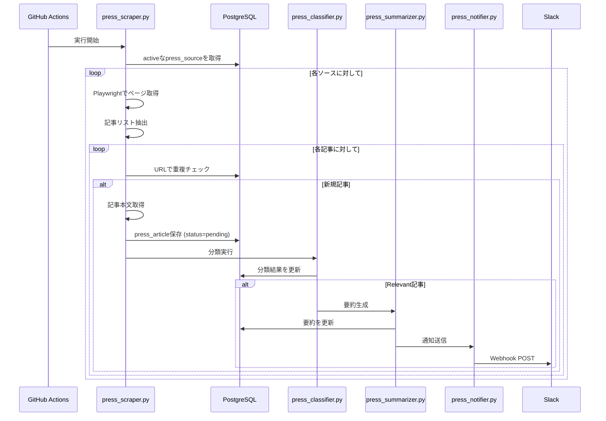
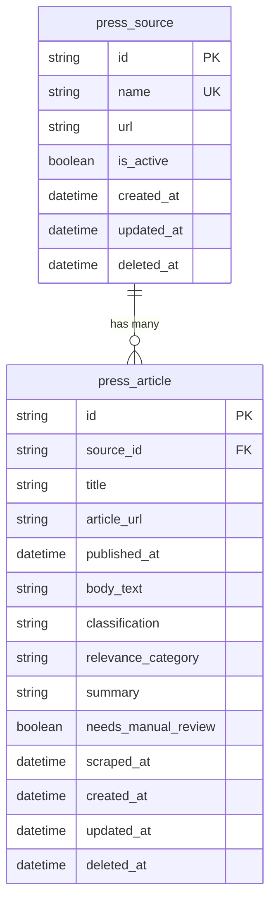

# Design Document: Press Release Monitor

## Overview

プレスリリースモニター機能は、既存のUI/UX変更検知システムに並行して動作する独立したデータパイプラインとして設計する。競合不動産ポータル（SUUMO, athome, カナリー）のプレスリリースページを日次で自動スクレイピングし、記事の分類・要約・Slack通知を自動化する。

### 設計方針

1. **データ分離**: Press_Article は既存の Change テーブルと完全に分離し、独立したテーブルに保存する
2. **パイプライン設計**: スクレイピング → 分類 → 要約 → 通知 の一方向フロー
3. **既存パターン踏襲**: 既存の scraper/analyzer 構成パターン（Python + psycopg2直接接続）を踏襲
4. **ルールベース分類**: 既存の `classify.py` と同様、外部AI APIに依存しないルールベース分類を採用
5. **フェイルセーフ**: 1ソースの失敗が他のソースの処理をブロックしない

### システム構成図



## Architecture

### レイヤー構成

| Layer | Technology | Responsibility |
|-------|-----------|---------------|
| Scraper | Python + Playwright + BeautifulSoup | プレスリリースページのクロール・記事抽出 |
| Analyzer | Python (ルールベース) | 関連性分類・要約生成 |
| Notifier | Python + httpx | Slack Webhook通知 |
| API | Next.js API Routes | Admin Dashboard向けCRUD |
| Frontend | Next.js + Tailwind CSS | ソース管理・履歴閲覧UI |
| MCP | TypeScript MCP Server | Kiro経由のデータアクセス |

### ディレクトリ構成

```
packages/
  scraper/src/
    press_scraper.py        # プレスリリーススクレイピング
    press_db.py             # press_source/press_article DB操作
  analyzer/src/
    press_classifier.py     # 関連性分類
    press_summarizer.py     # AI要約生成
    press_notifier.py       # Slack通知
  mcp-server/src/
    index.ts                # 既存ツール + pressリリースツール追加

apps/web/
  app/
    api/press-sources/      # ソース管理API
    api/press-articles/     # 記事一覧API
    press/                  # 管理画面ページ
  prisma/
    schema.prisma           # PressSource, PressArticle モデル追加
```

### パイプラインフロー



## Components and Interfaces

### 1. Press Scraper (`press_scraper.py`)

```python
class PressScraperConfig:
    timeout: int = 30  # seconds
    max_body_length: int = 100_000  # characters
    inter_request_delay: float = 2.0  # seconds

class PressArticleData:
    title: str           # max 512 chars
    url: str             # max 2048 chars
    published_at: datetime | None
    body_text: str       # max 100,000 chars
    source_id: str

async def scrape_press_source(source: PressSource) -> list[PressArticleData]:
    """ソースページから記事リストを取得し、新規記事の本文を取得する"""

async def extract_articles_from_page(html: str, base_url: str) -> list[dict]:
    """HTMLから記事タイトル・URL・日付を抽出する"""

async def fetch_article_body(url: str) -> str:
    """記事URLから本文テキストを取得する"""
```

各競合サイトのプレスリリースページは構造が異なるため、サイト固有の抽出ロジックを `PressSourceParser` として分離する:

```python
class PressSourceParser:
    """サイト固有の記事抽出ロジックの基底クラス"""
    def parse_article_list(self, html: str) -> list[dict]: ...
    def parse_article_body(self, html: str) -> str: ...

class SuumoPressParser(PressSourceParser): ...
class AthomePressParser(PressSourceParser): ...
class CanaryPressParser(PressSourceParser): ...
```

### 2. Press Classifier (`press_classifier.py`)

```python
RELEVANCE_CATEGORIES = [
    "service_feature",  # サービス機能に関する発表
    "market_data",      # 市場調査データ
    "ux_improvement",   # UX改善に関する発表
    "pricing",          # 料金改定
    "other",            # その他（関連だが上記に該当しない）
]

IRRELEVANT_PATTERNS = [
    r"人事|取締役|執行役|役員",
    r"決算|IR|投資家|株主",
    r"イベント|セミナー|展示会|協賛",
    r"CSR|SDGs|社会貢献",
    r"オフィス移転|組織変更",
]

RELEVANT_PATTERNS = {
    "service_feature": [...],
    "market_data": [...],
    "ux_improvement": [...],
    "pricing": [...],
}

def classify_press_article(title: str, body: str) -> ClassificationResult:
    """記事のタイトルと本文からRelevance分類を実行する"""

class ClassificationResult:
    is_relevant: bool
    category: str | None       # RELEVANCE_CATEGORIES のいずれか or None
    confidence: float          # 0.0 - 1.0
    needs_manual_review: bool  # confidence < threshold の場合True
```

分類ロジック:
1. まず `IRRELEVANT_PATTERNS` でマッチング → マッチすれば irrelevant
2. 次に `RELEVANT_PATTERNS` でカテゴリ別スコアリング
3. スコアが閾値未満の場合 → relevant + `needs_manual_review=True` (Requirements 3.6)

### 3. Press Summarizer (`press_summarizer.py`)

```python
def summarize_press_article(body: str, category: str) -> str:
    """記事本文からカテゴリに応じた要約を生成する (50-200文字)"""

def _extract_key_sentences(body: str, category: str) -> list[str]:
    """カテゴリに応じたキーセンテンスを抽出する"""

def _truncate_at_sentence_boundary(text: str, max_length: int = 200) -> str:
    """文の区切りで切り詰める"""
```

要約戦略:
- カテゴリ別のキーワード辞書に基づき、重要文を抽出
- 先頭文 + カテゴリ関連キーワードを含む文を優先選択
- 50〜200文字に収まるよう、文境界で切り詰め

### 4. Press Notifier (`press_notifier.py`)

```python
async def notify_press_article(article: PressArticle) -> bool:
    """Slack Webhookにプレスリリース通知を送信する"""

def format_slack_message(article: PressArticle) -> dict:
    """Slack Block Kit形式のメッセージを構成する"""
```

通知フォーマット:
```
📰 競合プレスリリース検知

*<article_url|article_title>*
ソース: source_name | 日付: 2025-01-15 | カテゴリ: service_feature

> AI要約テキスト...
```

リトライ: 失敗時30秒後に1回リトライ（Requirements 5.6, 5.7）

### 5. API Routes

| Endpoint | Method | Description |
|----------|--------|-------------|
| `/api/press-sources` | GET | ソース一覧取得 |
| `/api/press-sources` | POST | ソース新規登録 |
| `/api/press-sources/[id]` | PUT | ソース編集 |
| `/api/press-sources/[id]` | DELETE | ソース無効化（soft delete） |
| `/api/press-articles` | GET | 記事一覧取得（フィルタ・ページネーション対応） |

### 6. MCP Server Tools (追加)

| Tool | Description | Parameters |
|------|-------------|------------|
| `query_press_articles` | 記事検索 | source_name?, date_from?, date_to?, category?, limit(max 100) |
| `get_latest_press_articles` | ソースごとの最新N件取得 | source_name, count(1-50) |
| `list_press_sources` | 登録ソース一覧 | (none) |

## Data Models

### Prisma Schema追加

```prisma
model PressSource {
  id        String   @id @default(cuid())
  name      String   @unique
  url       String
  isActive  Boolean  @default(true)
  createdAt DateTime @default(now())
  updatedAt DateTime @updatedAt
  deletedAt DateTime?
  articles  PressArticle[]

  @@map("press_source")
}

model PressArticle {
  id               String    @id @default(cuid())
  sourceId         String
  title            String    @db.VarChar(512)
  articleUrl       String    @db.VarChar(2048)
  publishedAt      DateTime?
  bodyText         String?   @db.Text
  classification   String?   // "relevant" | "irrelevant" | "classification_failed"
  relevanceCategory String?  // "service_feature" | "market_data" | "ux_improvement" | "pricing" | "other"
  summary          String?   @db.VarChar(5000)
  needsManualReview Boolean @default(false)
  scrapedAt        DateTime  @default(now())
  createdAt        DateTime  @default(now())
  updatedAt        DateTime  @updatedAt
  deletedAt        DateTime?
  source           PressSource @relation(fields: [sourceId], references: [id], onDelete: Cascade)

  @@unique([sourceId, articleUrl])
  @@index([publishedAt(sort: Desc)])
  @@index([sourceId])
  @@index([classification])
  @@index([relevanceCategory])
  @@map("press_article")
}
```

### テーブル関係図



### バリデーションルール

| Field | Constraint |
|-------|-----------|
| PressSource.name | 1-50文字、英数字とハイフンのみ (`/^[a-zA-Z0-9-]{1,50}$/`) |
| PressSource.url | 有効な http/https URL |
| PressArticle.title | 最大512文字 |
| PressArticle.articleUrl | 最大2,048文字 |
| PressArticle.bodyText | 最大100,000文字 |
| PressArticle.summary | 最大5,000文字 |


## Correctness Properties

*A property is a characteristic or behavior that should hold true across all valid executions of a system — essentially, a formal statement about what the system should do. Properties serve as the bridge between human-readable specifications and machine-verifiable correctness guarantees.*

### Property 1: Source name and URL validation

*For any* string submitted as a Press_Source name, the validation function SHALL accept it if and only if it matches `/^[a-zA-Z0-9-]{1,50}$/`, and *for any* string submitted as a URL, the validation function SHALL accept it if and only if it is a syntactically valid URL with scheme `http` or `https`.

**Validates: Requirements 1.2**

### Property 2: Active source filtering

*For any* set of Press_Source records with varying `isActive` and `deletedAt` values, the query for sources to scrape SHALL return only those where `isActive=true` AND `deletedAt IS NULL`.

**Validates: Requirements 1.4, 2.4**

### Property 3: Duplicate URL rejection for sources

*For any* existing set of active Press_Source records and a new registration attempt, the system SHALL reject registration if and only if the submitted URL exactly matches the URL of an existing active (non-deleted) entry.

**Validates: Requirements 1.5**

### Property 4: Article extraction field completeness

*For any* valid HTML press release page containing article elements, the extractor SHALL return for each article a title (non-empty, ≤512 chars), a URL (non-empty, ≤2048 chars), and a body text (≤100,000 chars). Publication date may be null if not parseable.

**Validates: Requirements 2.2**

### Property 5: New article deduplication

*For any* set of existing Press_Article records and a list of candidate articles from a scraper run, the system SHALL save only those candidates whose `articleUrl` does not match any existing record's `articleUrl` for the same source.

**Validates: Requirements 2.3**

### Property 6: Scraper resilience across sources

*For any* ordered list of Press_Sources where one or more sources fail (HTTP timeout or status ≥400), the scraper SHALL still attempt to process all remaining sources in the list.

**Validates: Requirements 2.5**

### Property 7: Classification correctness

*For any* article whose title or body contains patterns from `IRRELEVANT_PATTERNS` (人事, IR, イベント, etc.) and no relevant patterns, the classifier SHALL return `is_relevant=false`. *For any* article whose title or body contains patterns from `RELEVANT_PATTERNS` with score above threshold and no irrelevant patterns, the classifier SHALL return `is_relevant=true`.

**Validates: Requirements 3.2, 3.3**

### Property 8: Relevant article category assignment and manual review flag

*For any* article classified as relevant, the classifier SHALL assign exactly one category from `["service_feature", "market_data", "ux_improvement", "pricing", "other"]`. *For any* article where no category achieves the confidence threshold, the classifier SHALL set `is_relevant=true` and `needs_manual_review=true`.

**Validates: Requirements 3.5, 3.6**

### Property 9: Summary length constraint

*For any* article body text provided to the summarizer, the generated summary SHALL have a length between 50 and 200 characters (inclusive).

**Validates: Requirements 4.2**

### Property 10: Summary truncation at sentence boundary

*For any* text that would produce a summary exceeding 200 characters before truncation, the truncation function SHALL return a string of at most 200 characters that ends at the last complete sentence boundary (。, ！, ？, or equivalent).

**Validates: Requirements 4.6**

### Property 11: Notification format completeness

*For any* Press_Article with all fields populated, the formatted Slack notification message SHALL contain the article title formatted as a clickable Slack link (`<url|title>`), the source name, the publication date, the relevance category, and the AI-generated summary.

**Validates: Requirements 5.2, 5.3**

### Property 12: Notification count matches article count

*For any* set of N Relevant_Articles summarized in a single scraping run (where N ≥ 1), the Slack_Notifier SHALL make exactly N notification POST requests.

**Validates: Requirements 5.4**

### Property 13: Notification resilience

*For any* set of articles to notify where the Slack webhook fails for some articles (even after retry), the notifier SHALL still attempt to send notifications for all remaining articles in the set.

**Validates: Requirements 5.7**

### Property 14: Article URL uniqueness per source

*For any* source_id and article_url combination, the database SHALL contain at most one Press_Article record. The same article_url MAY exist for different source_ids.

**Validates: Requirements 6.6**

### Property 15: Article list sorted by publication date descending

*For any* query result from the article list endpoint, the returned articles SHALL be ordered such that for consecutive items i and i+1, `items[i].publishedAt >= items[i+1].publishedAt`.

**Validates: Requirements 7.1**

### Property 16: AND-filter correctness

*For any* combination of filters (source, classification, category) applied to the article list, every returned article SHALL satisfy ALL applied filter conditions simultaneously.

**Validates: Requirements 7.2**

### Property 17: Title truncation

*For any* article title string, the display truncation function SHALL return the original title if its length is ≤80 characters, or a string of at most 83 characters (80 + "...") if the original exceeds 80 characters.

**Validates: Requirements 7.3**

### Property 18: Pagination correctness

*For any* total count of articles matching a query, the pagination SHALL return at most 20 articles per page, and the total page count SHALL equal `ceil(total_count / 20)`.

**Validates: Requirements 7.5**

### Property 19: MCP query result limit

*For any* query to `query_press_articles` that matches more than 100 records, the tool SHALL return at most 100 records.

**Validates: Requirements 8.1**

### Property 20: MCP response format completeness

*For any* article returned by MCP query tools, the response object SHALL contain the fields: title, url, publishedAt, relevanceCategory, and summary.

**Validates: Requirements 8.2**

### Property 21: MCP latest-N query correctness

*For any* valid N (1 ≤ N ≤ 50) and a source with M articles, the `get_latest_press_articles` tool SHALL return exactly `min(N, M)` articles, ordered by publication date descending.

**Validates: Requirements 8.3**

### Property 22: MCP invalid parameter error reporting

*For any* invalid parameter value passed to an MCP tool (non-existent source name, invalid date format, unrecognized category, or N outside 1-50), the error response SHALL include the parameter name and a reason string indicating why it is invalid.

**Validates: Requirements 8.4**

## Error Handling

### スクレイピングエラー

| Error Type | Handling | Recovery |
|-----------|----------|----------|
| HTTP Timeout (30s) | ログに記録、Slack通知、次のソースへ進む | 次回スケジュール実行で再試行 |
| HTTP 4xx/5xx | ログに記録、Slack通知、次のソースへ進む | 次回スケジュール実行で再試行 |
| HTML解析失敗 | ログに記録、スキップ | 管理画面でパーサー更新 |
| ネットワークエラー | ログに記録、Slack通知、次のソースへ進む | 次回スケジュール実行で再試行 |

### 分類・要約エラー

| Error Type | Handling | Recovery |
|-----------|----------|----------|
| 空コンテンツ | `classification_failed` で保存 | 手動確認 |
| パターンマッチ不確定 | relevant + `needs_manual_review` | 管理画面で手動確認 |
| 要約生成失敗 | 要約なしで保存、`needs_manual_review=true` | MCP経由で手動要約 |
| 要約文字数超過 | 文境界で200文字に切り詰め | 自動処理 |

### 通知エラー

| Error Type | Handling | Recovery |
|-----------|----------|----------|
| Slack Webhook失敗 | 30秒後に1回リトライ | リトライ成功で完了 |
| リトライ失敗 | ログに記録、当該記事スキップ | 管理画面から手動確認 |
| Webhook URL未設定 | 設定エラーログ、全通知スキップ | 環境変数設定後に再実行 |

### API エラー

| Error Type | HTTP Status | Response |
|-----------|-------------|----------|
| バリデーションエラー | 400 | `{ error: string, fields: { [field]: string } }` |
| 認証エラー | 401 | `{ error: "Unauthorized" }` |
| リソース未発見 | 404 | `{ error: "Not found" }` |
| 重複URL | 409 | `{ error: "URL already registered" }` |
| サーバーエラー | 500 | `{ error: "Internal server error" }` |

## Testing Strategy

### テストアプローチ

**Property-Based Testing (PBT)**:
- ライブラリ: `fast-check` (TypeScript, 既にdevDependenciesに存在)
- 実行回数: 各プロパティ最低100イテレーション
- 対象: バリデーション関数、フィルタリングロジック、フォーマッター、パーサー

**Unit Tests**:
- フレームワーク: `vitest` (既存構成)
- 対象: 特定のエッジケース、具体的な入出力例
- Python: `pytest` (追加)

**Integration Tests**:
- Slack通知、DB永続化、カスケード削除
- テスト用DBを使用

### Property-Based Testing 対象

| Property | Test File | What varies |
|----------|-----------|-------------|
| 1: Validation | `press-source-validation.prop.test.ts` | name strings, URL strings |
| 2: Active filtering | `press-source-filter.prop.test.ts` | source records with varying isActive/deletedAt |
| 3: Duplicate URL | `press-source-duplicate.prop.test.ts` | URL sets |
| 5: Deduplication | `press-article-dedup.prop.test.ts` | existing URLs, candidate URLs |
| 7: Classification | `press-classifier.prop.test.py` | article titles/bodies with keyword patterns |
| 8: Category assignment | `press-classifier.prop.test.py` | classifier output for relevant articles |
| 9: Summary length | `press-summarizer.prop.test.py` | article body texts of varying length |
| 10: Truncation | `press-summarizer.prop.test.py` | long text strings |
| 11: Notification format | `press-notifier-format.prop.test.ts` | PressArticle objects with all fields |
| 14: Uniqueness | `press-article-unique.prop.test.ts` | sourceId/articleUrl combinations |
| 15: Sort order | `press-article-list.prop.test.ts` | article sets with varying dates |
| 16: Filter correctness | `press-article-list.prop.test.ts` | filter combinations, article attributes |
| 17: Title truncation | `press-article-display.prop.test.ts` | title strings of varying length |
| 18: Pagination | `press-article-list.prop.test.ts` | article counts |
| 19-22: MCP tools | `press-mcp-tools.prop.test.ts` | query parameters, result sets |

### テスト構成

```
apps/web/
  __tests__/
    api/
      press-sources.test.ts          # API Route unit tests
      press-articles.test.ts         # API Route unit tests
    properties/
      press-source-validation.prop.test.ts
      press-source-filter.prop.test.ts
      press-article-list.prop.test.ts
      press-article-display.prop.test.ts
      press-notifier-format.prop.test.ts
      press-mcp-tools.prop.test.ts

packages/analyzer/
  tests/
    test_press_classifier.py         # Unit tests
    test_press_summarizer.py         # Unit tests
    prop_test_press_classifier.py    # Property tests (hypothesis)
    prop_test_press_summarizer.py    # Property tests (hypothesis)

packages/scraper/
  tests/
    test_press_scraper.py            # Unit tests
    test_press_db.py                 # Integration tests
```

### PBT設定

**TypeScript (fast-check)**:
```typescript
// vitest.config.ts に追加設定不要、各テストファイル内で設定
fc.assert(fc.property(...), { numRuns: 100 });
```

**Python (hypothesis)**:
```python
# requirements-dev.txt に追加
hypothesis>=6.100.0

# 各テストファイル内で設定
@settings(max_examples=100)
```

### テストタグフォーマット

各プロパティテストには以下のコメントタグを付与:

```typescript
// Feature: press-release-monitor, Property 1: Source name and URL validation
```

```python
# Feature: press-release-monitor, Property 7: Classification correctness
```
